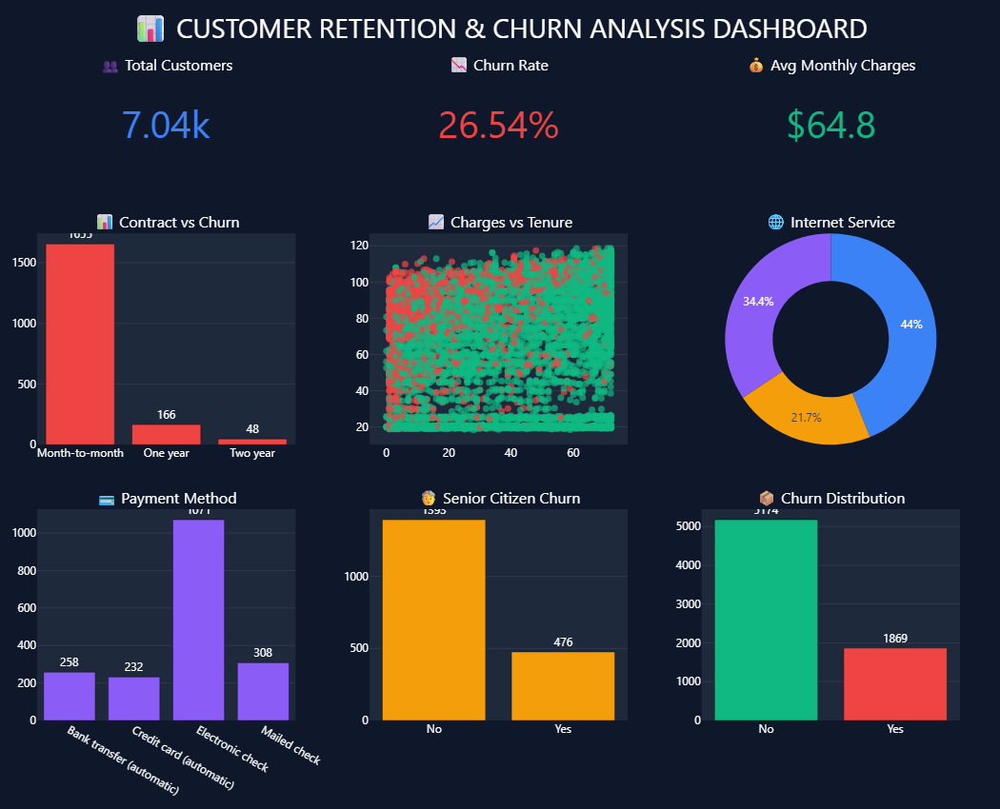

# 📊 FUTURE_DS_02  
## Customer Retention & Churn Analysis
---

# 🚀 Future Interns - Data Science & Analytics Internship

### 📌 Task 2: Customer Retention & Churn Analysis

This project focuses on analyzing customer churn behavior in a telecom subscription-based business using Python and interactive visualizations.

The goal of this project is to:
- Analyze churn patterns
- Identify retention drivers
- Understand customer behavior
- Generate business insights
- Build an interactive analytics dashboard

---

# 📂 Repository Structure

```bash
FUTURE_DS_02/
│
├── dataset/
│   └── WA_Fn-UseC_-Telco-Customer-Churn.csv
│
├── notebook/
│   ├── Analysis.ipynb
│
├── dashboard/
│   ├── Dashboard.ipynb
│   ├── dashboard.png
│
├── images/
│   ├── charts.png(1-14)
│
├── report/
│   ├── Task_Report.pdf
│
├── insights/
│   ├── key_insight.md
│
├── requirements.txt
└── README.md
```

---

# 📊 Dashboard Preview

## 🚀 Interactive Customer Churn Dashboard



---

# 🎯 Project Objectives

The main objectives of this project are:

✅ Analyze customer churn patterns  
✅ Identify high-risk churn customers  
✅ Understand customer retention trends  
✅ Visualize business insights interactively  
✅ Generate actionable business recommendations  

---

# 🛠️ Technologies Used

| Technology | Purpose |
|---|---|
| Python | Data Analysis |
| Pandas | Data Cleaning |
| NumPy | Numerical Operations |
| Matplotlib | Basic Visualization |
| Seaborn | Statistical Visualization |
| Plotly | Interactive Dashboard |
| Jupyter Notebook | Development Environment |

---

# 🧹 Data Cleaning Process

The dataset was cleaned using Pandas by:

- Handling missing values
- Converting incorrect data types
- Removing inconsistencies
- Preparing data for analysis

---

# 📈 Exploratory Data Analysis (EDA)

## 🔹 Univariate Analysis
- Churn Distribution
- Contract Type Analysis
- Internet Service Distribution
- Monthly Charges Distribution

## 🔹 Bivariate Analysis
- Churn vs Contract Type
- Churn vs Payment Method
- Monthly Charges vs Churn
- Tenure vs Churn

## 🔹 Advanced Visualization
- Correlation Heatmap
- Interactive Plotly Charts
- Scatter Plots
- Pie Charts
- Histograms

---

# 📊 Interactive Dashboard Features

The dashboard includes:

✅ KPI Cards  
✅ Churn Analysis  
✅ Contract Type Analysis  
✅ Internet Service Distribution  
✅ Payment Method Insights  
✅ Monthly Charges vs Tenure  
✅ Customer Segmentation  

---

# 💡 Key Insights

📌 Month-to-month contract customers show the highest churn rate.  

📌 Customers with high monthly charges are more likely to churn.  

📌 Fiber optic internet users contribute significantly to churn.  

📌 Electronic check users have higher churn probability.  

📌 Long-term customers show better retention behavior.  

---

# 🚀 Business Recommendations

✅ Offer discounts for long-term contracts  

✅ Improve support quality for high-risk customers  

✅ Reduce churn through targeted retention campaigns  

✅ Encourage automatic payment methods  

✅ Improve customer satisfaction for fiber optic users  

---

# 📁 Dataset Information

### Dataset Used:
Telco Customer Churn Dataset

This dataset contains:
- Customer demographics
- Subscription information
- Billing details
- Churn status

---

# ▶️ How to Run This Project

## 1️⃣ Clone Repository

```bash
git clone https://github.com/yourusername/FUTURE_DS_02.git
```

---

## 2️⃣ Install Libraries

```bash
pip install -r requirements.txt
```

---

## 3️⃣ Run Jupyter Notebook

```bash
jupyter notebook
```

---

# 📦 Requirements

```txt
pandas
numpy
matplotlib
seaborn
plotly
jupyter
```

---

# 👩‍💻 Author

## Purvi Jain
---

# ⭐ Acknowledgement

This project was completed as part of the Future Interns Data Science & Analytics Internship Program.

---

<div align="center">

## ⭐ If you like this project, give it a star ⭐

</div>
